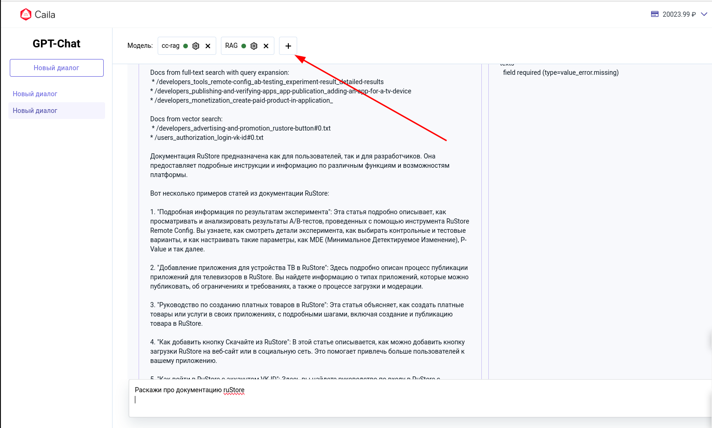
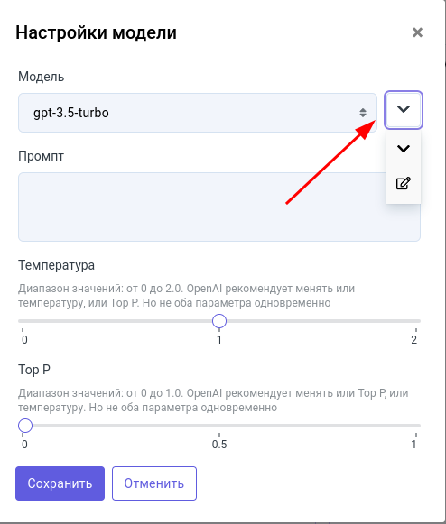
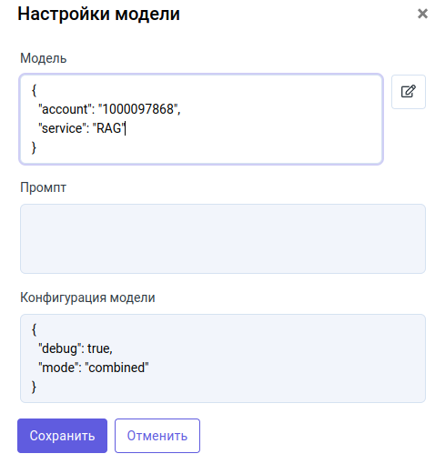

# RAG pipeline ruStore

Модуль состоит из трёх частей
- Парсер сайта https://github.com/hackaton-labelAI/chat-bot
- Сохранённая информация https://github.com/hackaton-labelAI/cc-data
- Поиск https://github.com/hackaton-labelAI/cc-back

**Для проверки готового решения** перейдите на https://caila.io/app/just-ai/mlp-gpt-chat-app.
Далее нам надо добавить наш сервис 
Далее нажимаем на кнопку выбора сервиса и переходим в режим разработчика


Далее вводим конфиги модели 


``{
"account": "1000097868",
"service": "RAG"
}``
``{
"debug": true,
"mode": "combined"
}``

Нажимаем сохранить.

**Теперь вы можете пользоватся чатом** и проверять его работоспособность


**Для комфортной проверки решения** скачать модули Сохранённая информация и Поиск. 
Положить их в одну папку. Скачать зависимости командой 

```mvn install```

Запустить модуль индексацию документации, вызвать функцию main в файле src/main/kotlin/cc/services/searches/LuceneIndexService.kt

Запустить сервис

```mvn spring-boot:start```